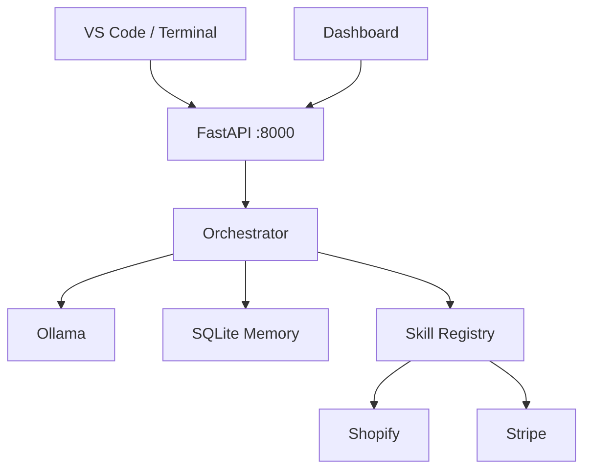

# APEX Local Architecture

VS Code/terminal and dashboard call the FastAPI backend. The orchestrator loads routing and security policy, selects an Ollama model, and exposes explicitly registered skills. SQLite provides persistent local memory. External business services are invoked only through skills and approval gates.

