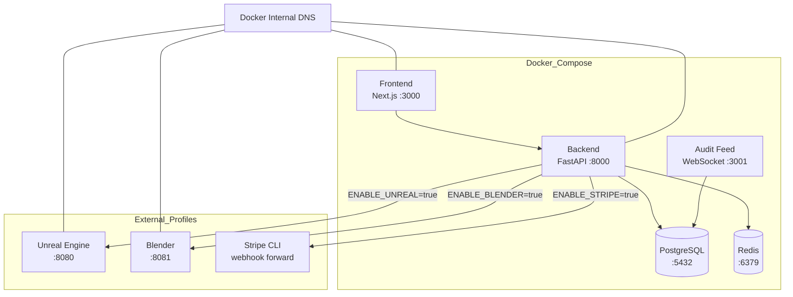
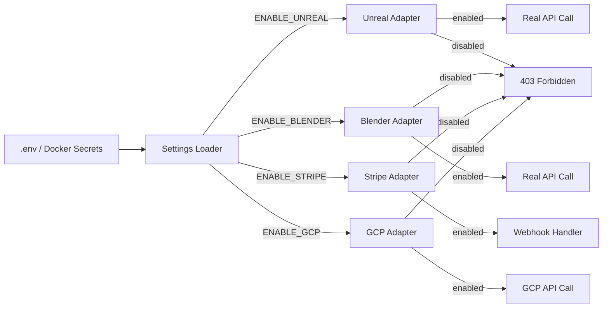

# 🐳 APEX SOVEREIGN MASTER BLUEPRINT — DOCKER INTEGRATION ADDENDUM

**Version:** 1.0.1  
**Date:** 2026-08-24  
**Status:** INTEGRATED — AWAITING RUNTIME VERIFICATION

> This document is the Docker integration specification. It is not evidence that the runtime stack has passed verification. No fake-green promotion is permitted.

---

## 1. Docker Architecture



### Integration Toggle Flow



---

## 2. Repository Structure

```text
APEX/
├── Dockerfile
├── docker-compose.yml
├── docker-compose.external.yml
├── docker-entrypoint.sh
├── .env.example
├── .gitignore                    # .env excluded
├── backend/
│   ├── main.py                   # FastAPI with toggles
│   ├── integrations/
│   │   ├── config.py             # Pydantic settings
│   │   ├── unreal_adapter.py
│   │   ├── blender_adapter.py
│   │   ├── stripe_adapter.py
│   │   └── gcp_adapter.py        # optional
│   └── audit_feed_server.py
├── app/                          # Next.js frontend
│   ├── components/
│   │   └── IntegrationToggle.tsx
│   ├── gabby/
│   │   ├── lib/
│   │   └── page.tsx              # integration-aware
│   └── experience/
└── ...                           # all previous APEX files
```

---

## 3. Key Files

| File | Purpose |
|---|---|
| `Dockerfile` | Multi-stage build (Node + Python), healthcheck, entrypoint |
| `docker-compose.yml` | Core stack: frontend, backend, PostgreSQL, Redis, audit WebSocket |
| `docker-compose.external.yml` | Optional profiles for Unreal, Blender, Stripe CLI |
| `docker-entrypoint.sh` | Starts backend + frontend, logs toggle states |
| `.env.example` | Template for integration toggles and API keys; never commit real values |
| `backend/main.py` | FastAPI app with toggleable routes and health endpoint |
| `backend/integrations/config.py` | Pydantic settings loaded from environment |
| `app/components/IntegrationToggle.tsx` | Frontend indicator for enabled/disabled integrations |

---

## 4. Honest Status Table

| Component | Status | Evidence | Next Step |
|---|---|---|---|
| Dockerfile | IMPLEMENTED | Multi-stage build + healthcheck provided | Build locally |
| docker-compose core stack | IMPLEMENTED | Full YAML supplied | `docker-compose up` |
| External service profiles | IMPLEMENTED | Profiles for Unreal/Blender/Stripe | Start with profiles |
| Integration toggles | IMPLEMENTED | Backend + frontend enforce toggles | Test 403/200 paths |
| Unreal adapter | NOT_CONNECTED | Code ready, no live key | Test with real Unreal instance |
| Blender adapter | NOT_CONNECTED | Code ready, no live key | Test with real Blender instance |
| Stripe adapter | NOT_CONNECTED | Webhook route ready | Test with Stripe CLI |
| GCP adapter | NOT_IMPLEMENTED | Toggle exists, adapter pending | Add when needed |
| Audit Feed in Docker | IMPLEMENTED | WebSocket service defined | Verify real-time events |
| Docker secrets | IMPLEMENTED | `.env.example` + Docker secret command | Configure production |

**Important:** These statuses are the supplied blueprint state. They are not runtime verification performed by this commit.

---

## 5. Immediate Verification Commands

```bash
# 1. Build and start core stack
docker-compose build
docker-compose up -d

# 2. Check health + toggles
curl -X GET http://localhost:8000/api/health

# 3. Test disabled integration (expect 403)
curl -X POST http://localhost:8000/api/unreal/connect

# 4. Start with Unreal + Blender enabled (real keys required)
ENABLE_UNREAL=true UNREAL_API_KEY=your_key \
ENABLE_BLENDER=true BLENDER_API_KEY=your_key \
docker-compose -f docker-compose.yml -f docker-compose.external.yml \
  --profile unreal --profile blender up -d

# 5. Test Audit Feed WebSocket
websocat ws://localhost:3001/api/audit/ws

# 6. Verify service discovery
docker-compose exec backend ping unreal-engine
```

> Replace placeholder credentials only through the approved secret/credential mechanism. Never commit real API keys, OAuth client secrets, private keys, webhook secrets, or identity files.

---

## 6. Recommended Verification Sequence

1. Build and run the core stack locally.
2. Verify the health endpoint and toggle state.
3. Verify disabled integrations return `403`.
4. Verify enabled integrations make real calls only when real credentials and services exist.
5. Connect Unreal/Blender only with real instances and approved credentials.
6. Test Stripe webhooks with test credentials/CLI.
7. Verify Audit Feed events arrive in real time.
8. Verify Docker internal DNS/service discovery.
9. Validate secret injection without exposing values in logs or repository history.
10. Promote to staging only after captured evidence passes.
11. Promote to production only after staging verification passes.

---

## 7. Security Requirements

- `.env` and all secret-bearing files remain excluded from Git.
- Secrets must be injected through the approved secret mechanism; this document contains placeholders only.
- Integration toggles are authorization boundaries, not merely UI indicators.
- Disabled integrations must fail closed with `403` and must not invoke an external service.
- Enabled integrations must perform real calls; mocked success must not be treated as production evidence.
- Audit events must record the identity, integration, action, result, and denial reason where applicable without recording secret values.
- Production credentials must not be copied into chat, source files, client-side bundles, or logs.
- High-risk operations require the APEX authorization/approval layer before execution.

---

## 8. Relationship to APEX Identity / MCP Security

This Docker layer sits beneath the APEX agent and MCP security architecture. Agent access should follow the identity chain:

```text
Human / Agent Identity
        ↓
SSO / Short-Lived Identity
        ↓
APEX Gatekeeper / Authorization Policy
        ↓
MCP or Integration Adapter
        ↓
Docker Service Boundary
        ↓
External System
        ↓
Audit Event / Verification
```

The Docker layer must not become a backdoor around APEX authorization. A container having network access does not itself grant an agent permission to use the integration.

---

## 9. Verification Gate

**Promotion rule:**

> If the service was not actually built, started, exercised, and observed with evidence, its status remains `AWAITING RUNTIME VERIFICATION`.

Required evidence before marking the Docker layer verified:

- build output succeeds;
- all core containers report healthy;
- `/api/health` returns the expected state;
- disabled integration produces `403` and no external call;
- enabled integration produces a real successful call against the intended test service;
- Audit Feed receives the corresponding event;
- secret values are absent from logs and repository content;
- Docker DNS resolves required service names;
- failures are fail-closed and auditable.

**Signal Absolute. Godspeed.**
