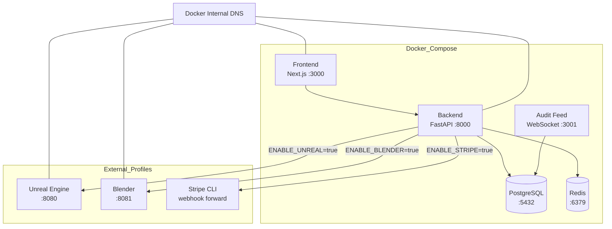
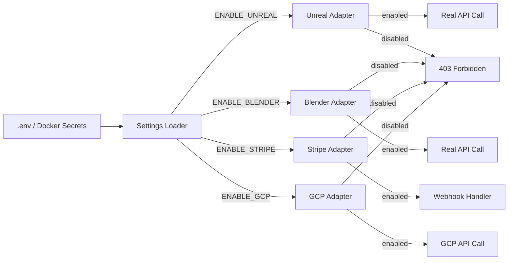

# APEX SOVEREIGN MASTER BLUEPRINT — DOCKER INTEGRATION ADDENDUM

**Version:** 1.0.1  
**Date:** 2026-08-24  
**Document status:** INTEGRATED — AWAITING RUNTIME VERIFICATION

> This document records the supplied Docker/integration architecture. It does not assert that the described files, services, credentials, external engines, staging deployment, or GCP runtime currently exist or have executed.

## 1. Docker Architecture



### Integration Toggle Flow



## 2. Proposed Repository Structure

```text
APEX/
├── Dockerfile
├── docker-compose.yml
├── docker-compose.external.yml
├── docker-entrypoint.sh
├── .env.example
├── .gitignore
├── backend/
│   ├── main.py
│   ├── integrations/
│   │   ├── config.py
│   │   ├── unreal_adapter.py
│   │   ├── blender_adapter.py
│   │   ├── stripe_adapter.py
│   │   └── gcp_adapter.py
│   └── audit_feed_server.py
├── app/
│   ├── components/
│   │   └── IntegrationToggle.tsx
│   ├── gabby/
│   │   ├── lib/
│   │   └── page.tsx
│   └── experience/
└── ...
```

**Important:** this is a target structure from the supplied blueprint. A file is not considered implemented merely because it appears in this document.

## 3. Integration Contracts

### Docker

The core stack is intended to include frontend, backend, PostgreSQL, Redis, and Audit Feed WebSocket services.

### Unreal / Blender

Toggles must gate real adapter execution. Disabled integrations should fail explicitly rather than silently pretending to connect.

### Stripe

Stripe webhook testing should use the official Stripe CLI and test credentials where applicable. No unofficial consumer-web automation.

### GCP

GCP remains optional and must not be marked implemented until a concrete use case and runtime adapter are actually present and verified.

## 4. Secret Safety

No real credentials belong in source control.

Production/staging credentials should use an approved secret mechanism such as Docker secrets or an approved Vault implementation. `.env.example` may document variable names and safe defaults but must not contain real secrets.

Do not place credentials in:

- source code
- audit payloads
- chat history
- frontend state
- logs
- canonical memory

## 5. Staging Architecture

The supplied staging design includes:

- Linux Docker host
- staging domain
- TLS termination through Nginx
- Certbot-managed certificates
- frontend
- backend
- PostgreSQL
- Redis
- Audit Feed
- Docker secrets

The staging environment remains `UNVERIFIED` until deployment evidence is observed.

## 6. Verification Requirements

Before any component is promoted to green, verify the actual environment.

### Core Docker

- image build succeeds
- containers start
- health endpoint responds
- service-to-service networking works
- database connectivity works
- Redis connectivity works
- Audit Feed starts

### Integration toggles

For each integration test both paths:

1. disabled → expected explicit rejection;
2. enabled → real adapter execution;
3. valid credentials/configuration → successful provider operation where available;
4. invalid/missing credentials → truthful failure;
5. Audit Feed receives the consequential event.

### Audit Feed

Verify:

- event creation
- required event fields
- append-only behavior
- hash/previous-hash linkage
- idempotency
- consumer cursor behavior
- replay/query behavior
- sensitive-data exclusion

### Unreal / Blender

Do not claim `CONNECTED` until an actual reachable engine/service responds through the real adapter and the result is recorded as evidence.

### GCP

Do not claim `UPLOADED`, `DOWNLOADED`, `CONNECTED`, or `HEALTHY` until a real GCP operation has executed successfully and produced an audit/evidence record.

## 7. Honest Status Baseline

| Component | Initial status from supplied blueprint | Promotion evidence required |
|---|---|---|
| Dockerfile | SPECIFIED / IMPLEMENTATION TO VERIFY | successful build + runtime |
| Docker Compose core stack | SPECIFIED / IMPLEMENTATION TO VERIFY | containers + health + networking |
| External service profiles | SPECIFIED / IMPLEMENTATION TO VERIFY | profile startup + service discovery |
| Integration toggles | SPECIFIED / IMPLEMENTATION TO VERIFY | disabled/enabled tests |
| Unreal adapter | NOT_CONNECTED | real Unreal execution |
| Blender adapter | NOT_CONNECTED | real Blender execution |
| Stripe adapter | NOT_CONNECTED | real Stripe test webhook |
| GCP adapter | NOT_IMPLEMENTED unless repository evidence proves otherwise | adapter + real GCP test |
| Audit Feed in Docker | IMPLEMENTATION CLAIMED IN SOURCE BLUEPRINT / RUNTIME UNVERIFIED | live event + integrity tests |
| Docker secrets | SPECIFIED | actual secret injection without source exposure |
| Staging deployment | NOT_DEPLOYED | observed staging runtime |

## 8. No-Fake-Green Rule for This Addendum

The following are **not evidence** of runtime success:

- YAML existing in GitHub
- a Mermaid diagram
- an expected curl response
- a proposed domain
- a placeholder registry image
- a placeholder API key
- a code snippet
- an AI-generated status table
- a green UI indicator without backend evidence

Runtime state must be derived from observed execution and recorded evidence.

## 9. Recommended Execution Order

1. inspect current repository;
2. locate existing Docker/integration implementations;
3. identify duplicates and overlaps;
4. validate configuration and secret boundaries;
5. build core stack;
6. run health/network/database/Redis checks;
7. test disabled integration paths;
8. test enabled integrations only where real services/credentials exist;
9. verify Audit Feed events and integrity;
10. test local AI/model runtime discovery;
11. deploy to staging only after local evidence is sufficient;
12. verify staging;
13. record all results in the Audit Feed and implementation records.

**Status:** ARCHITECTURE RECORDED. RUNTIME VERIFICATION REQUIRED.
